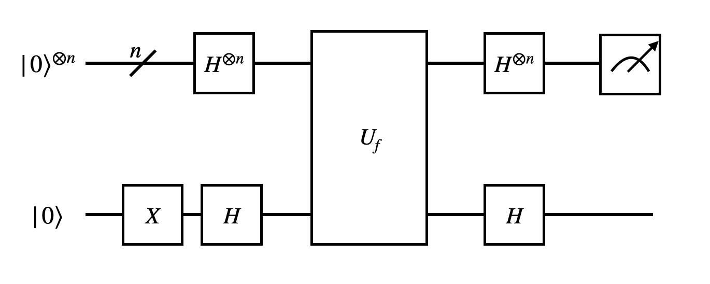
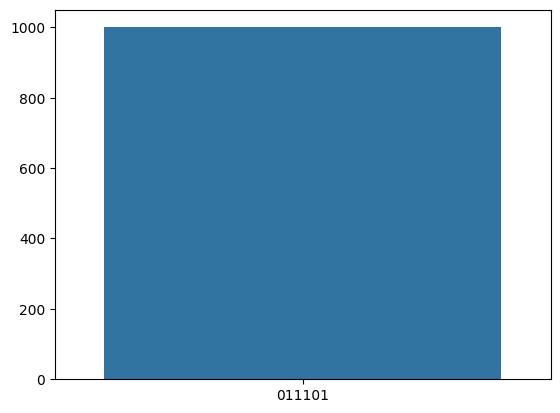

# Bernstein-Vazirani Algorithm

The Bernstein-Vazirani algorithm is an algorithm that deterministically solves the following problem:

Suppose there is a secret bit string $s = s_{n-1}\cdots s_1 s_0$ and an [oracle](https://dojo.qulacs.org/en/latest/notebooks/8.1_oracle.html) that implements the function

$$
    \begin{equation}
        f(x) = s_0 x_0 \oplus s_1 x_1 \oplus \cdots \oplus s_{n-1} x_{n-1}
    \end{equation}
$$

Find the secret bit string $s$.

We demonstrate how to use QURI Parts to implement the algorithm.

## Building the problem oracle

Now, let's build the quantum circuit that implements the oracle.


```python
from quri_parts.circuit import QuantumCircuit
from quri_parts.circuit.utils.circuit_drawer import draw_circuit

def get_bv_oracle(s: int, bit_length: int) -> QuantumCircuit:
    circuit = QuantumCircuit(bit_length + 1)
    for i in range(bit_length):
        this_s = (s >> i) & 1
        if this_s:
            circuit.add_CNOT_gate(i, bit_length)
    return circuit
```

As an example, let's assume the secret bit string is $1101$ and see what the oracle circuit looks like:


```python
draw_circuit(get_bv_oracle(0b1101, 4))
```

```                              
#output                              
    0 ----●-------------------
          |                   
          |                   
          |                   
    1 ----|-------------------
          |                   
          |                   
          |                   
    2 ----|-------●-----------
          |       |           
          |       |           
          |       |           
    3 ----|-------|-------●---
          |       |       |   
         _|_     _|_     _|_  
        |CX |   |CX |   |CX | 
    4 --|0  |---|1  |---|2  |-
        |___|   |___|   |___| 
```
We may confirm that the oracle we implemented is indeed correct. Let's assume that the secret string is $1101$


```python
import numpy as np
from functools import reduce
import pandas as pd
from quri_parts.core.state import ComputationalBasisState
from quri_parts.qulacs.simulator import evaluate_state_to_vector 

n_bit_length = 4
n_qubits = n_bit_length + 1
s = 0b1101
oracle = get_bv_oracle(s, 4)

recorder = {}
for i in range(2**n_bit_length):
    out_vector = evaluate_state_to_vector(
        ComputationalBasisState(n_qubits, bits=i).with_gates_applied(oracle)
    ).vector

    oracle_evaluted = np.where(out_vector)[0][0] >> n_bit_length
    expected = reduce(lambda x, y: x^y, [((i & s) >> j) & 1 for j in range(n_bit_length)])

    recorder[i] = {"oracle": oracle_evaluted, "expected": expected}

print(pd.DataFrame.from_dict(recorder).to_markdown())
```

    |          |   0 |   1 |   2 |   3 |   4 |   5 |   6 |   7 |   8 |   9 |   10 |   11 |   12 |   13 |   14 |   15 |
    |:---------|----:|----:|----:|----:|----:|----:|----:|----:|----:|----:|-----:|-----:|-----:|-----:|-----:|-----:|
    | oracle   |   0 |   1 |   0 |   1 |   1 |   0 |   1 |   0 |   1 |   0 |    1 |    0 |    0 |    1 |    0 |    1 |
    | expected |   0 |   1 |   0 |   1 |   1 |   0 |   1 |   0 |   1 |   0 |    1 |    0 |    0 |    1 |    0 |    1 |


Given the table above, we have confirmed that the oracle implemention is indeed correct.

## Building the Bernstein-Vazirani algorithm circuit

Now, let's build the circuit that implements the Bernstein-Vazirani algorithm. The circuit looks like:




```python
import numpy as np

def get_bv_algorithm_circuit(oracle: QuantumCircuit) -> QuantumCircuit:

    bit_length = oracle.qubit_count - 1
    circuit = QuantumCircuit(oracle.qubit_count)
    
    circuit.add_X_gate(bit_length)

    for i in range(bit_length + 1):
        circuit.add_H_gate(i)

    circuit.extend(oracle)
    
    for i in range(bit_length + 1):
        circuit.add_H_gate(i)

    return circuit
```

Now, let's look at the what the circuit implementing the algorithm looks like.


```python
oracle = get_bv_oracle(0b110101, 6)
draw_circuit(get_bv_algorithm_circuit(oracle))
```
```
#output
         ___                     ___                          
        | H |                   | H |                         
    0 --|1  |-------------●-----|12 |-------------------------
        |___|             |     |___|                         
         ___     ___      |                                   
        | H |   | H |     |                                   
    1 --|2  |---|13 |-----|-----------------------------------
        |___|   |___|     |                                   
         ___              |              ___                  
        | H |             |             | H |                 
    2 --|3  |-------------|-------●-----|14 |-----------------
        |___|             |       |     |___|                 
         ___     ___      |       |                           
        | H |   | H |     |       |                           
    3 --|4  |---|15 |-----|-------|---------------------------
        |___|   |___|     |       |                           
         ___              |       |              ___          
        | H |             |       |             | H |         
    4 --|5  |-------------|-------|-------●-----|16 |---------
        |___|             |       |       |     |___|         
         ___              |       |       |              ___  
        | H |             |       |       |             | H | 
    5 --|6  |-------------|-------|-------|-------●-----|17 |-
        |___|             |       |       |       |     |___| 
         ___     ___     _|_     _|_     _|_     _|_     ___  
        | X |   | H |   |CX |   |CX |   |CX |   |CX |   | H | 
    6 --|0  |---|7  |---|8  |---|9  |---|10 |---|11 |---|18 |-
        |___|   |___|   |___|   |___|   |___|   |___|   |___| 

```
Finally, let's construct a function that executes the algorithm. As the algorithm is deterministic, it can be executed using a sampler with only 1 shot.


```python
from quri_parts.qulacs.sampler import create_qulacs_vector_sampler

def get_secret_string(oracle: QuantumCircuit, n_shot: int = 1) -> dict[str, int]:
    algorithm = get_bv_algorithm_circuit(oracle)
    n_qubits = algorithm.qubit_count
    
    sampler = create_qulacs_vector_sampler()
    sampling_cnt = sampler(algorithm, n_shot)

    get_secret_string_from_int = lambda s: bin(s)[2:].zfill(n_qubits)[1:]

    return {get_secret_string_from_int(s): v for s, v in sampling_cnt.items()}
```

Now, let's execute the algorithm with the secret string fed to the oracle being $s = 011101$.


```python
bit_length = 6
s = 0b011101
oracle = get_bv_oracle(s, bit_length)
next(iter(get_secret_string(oracle)))
```


```
#output
    '011101'
```

The algorithm indeed gives us the desiresd result as expected.

### Showing that the algorithm is deterministic

To ensure the algorithm is indeed deterministic, let's run the circuit 1000 times and see if it gives the exact same result every time.


```python
import seaborn as sns
import matplotlib.pyplot as plt

counts = get_secret_string(oracle, n_shot=1000)
sns.barplot(counts, x=counts.keys(), y=counts.values())
plt.show()
```


    

    


Given that every execution gives the exact same result, we have confirmed that the algorithm is deterministic
