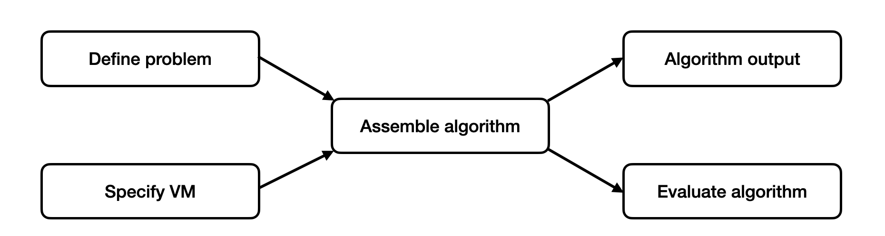

# QURI SDK Introduction

In this tutorial, we explain how to use the QURI VM to evaluate an algorithm. The workflow in this tutorial is illustrated in the following flow chart



The steps in the flow chart are:

- Define problem: Define the problem you want to solve. Here for example, we want to evaluate the expectation value $\langle e^{-iHt} \rangle$, where $H$ is the Hamiltonian of a hydrogen molecule.
- Specify VM: Define the virtual machine (VM) that encapsulates device information and executors.
- Assemble algorithm: A function that defines the algorithm. In this case, we use the Hadamard test to evaluate the desired expectation value $\langle e^{-iHt} \rangle$. The validity of our evaluation depends on the device, so a VM should be passed in as part of the algorithm.
- Algorithm output: The value of $\langle e^{-iHt} \rangle$ from the algorithm.
- Evaluate algorithm: The cost we need to run the algorithm, e.g. number of gates, circuit depth, execution time and circuit fidelity

We pick estimating the $\langle e^{-iHt}\rangle$ as the problem because it is an important building block of the statistical phase estimation, which is one of the major components in the QURI Algo library. We use this simplified example to demonstrate how different components of the QURI SDK work with each other to help you on your algorithm research journey.

## Set up the problem

Following the flow chart, we first define our problem. Here, the hydrogen molecule's Hamiltonian is used as an example. We build the Hamiltonian with QURI Parts and wrap it inside a `HamiltonianInput` that defines a problem in QURI Algo. Please refer to the QURI Parts [Hamiltonian generation tutorial](https://quri-parts.qunasys.com/docs/tutorials/quantum-chemistry/hamiltonian/hamiltonian/) and the QURI Algo [time evolution tutorial](../quri-algo/basics/time_evolution/index.md) for detailed explanations.


```python
from pyscf import gto, scf
from quri_parts.pyscf.mol import get_spin_mo_integrals_from_mole
from quri_parts.openfermion.mol import get_qubit_mapped_hamiltonian
from quri_parts.core.operator import Operator, PAULI_IDENTITY
from quri_algo.problem import QubitHamiltonian

mole = gto.M(atom="H 0 0 0; H 0 0 1")
mf = scf.RHF(mole).run()
hamiltonian, mapping = get_qubit_mapped_hamiltonian(
    *get_spin_mo_integrals_from_mole(mole, mf.mo_coeff)
)

# To avoid redundancy, we remove the identity part of the Hamiltonian,
# keeping only the part with non-trivial interactions.
eff_hamiltonian = hamiltonian - Operator({PAULI_IDENTITY: hamiltonian.constant})
hamiltonian_input = QubitHamiltonian(mapping.n_qubits, eff_hamiltonian)
```
```output
converged SCF energy = -1.06610864931794
```

```python
print(hamiltonian)
```
```output
(-0.3276081896748092+0j)*I + (0.13716572937099503+0j)*Z0 + (0.13716572937099503+0j)*Z1 + (-0.13036292057109103+0j)*Z2 + (-0.13036292057109103+0j)*Z3 + (0.15660062488237947+0j)*Z0 Z1 + (0.10622904490856078+0j)*Z0 Z2 + (0.15542669077992832+0j)*Z0 Z3 + (0.15542669077992832+0j)*Z1 Z2 + (0.10622904490856078+0j)*Z1 Z3 + (0.16326768673564343+0j)*Z2 Z3 + -0.049197645871367546*X0 X1 Y2 Y3 + 0.049197645871367546*X0 Y1 Y2 X3 + 0.049197645871367546*Y0 X1 X2 Y3 + -0.049197645871367546*Y0 Y1 X2 X3
```
## Specify VM

Now, we specify the VM that drives our algorithm execution. Various types of devices and architectures are provided in QURI VM for you to customize the details of the device you want to simulate on.

### Device properties

We build 2 VMs here corresponding to 
- A NISQ superconducting device 
- A device that runs on the STAR architecture 

#### Generate NISQ Device properties

First, generate a set of NISQ device properties.


```python
from quri_parts.backend.devices import nisq_spcond_lattice
from quri_parts.circuit.topology import SquareLattice
from quri_parts.backend.units import TimeValue, TimeUnit

nisq_property = nisq_spcond_lattice.generate_device_property(
    lattice=SquareLattice(5, 5),
    native_gates_1q=("RZ", "SqrtX", "X"),
    native_gates_2q=("CNOT",),
    gate_error_1q=1e-3,
    gate_error_2q=1e-2,
    gate_error_meas=1e-2,
    gate_time_1q=TimeValue(60, TimeUnit.NANOSECOND),
    gate_time_2q=TimeValue(660, TimeUnit.NANOSECOND),
    gate_time_meas=TimeValue(1.4, TimeUnit.MICROSECOND),
)
```

You can print out the properties for to inspect the details


```python
from quri_parts.circuit import RZ, SqrtX, X, CNOT

print("NISQ device:")
print("----------------------------")
print("Logical qubit count:", nisq_property.qubit_count)
print("Physical qubit count:", nisq_property.physical_qubit_count)
print("native_gates:", nisq_property.native_gates)
print("\n")

print("NISQ Gate properties:")
print("----------------------------")
print("X gate property:", nisq_property.gate_property(X(0)))
print("SqrtX gate property:", nisq_property.gate_property(SqrtX(0)))
print("CNOT gate property:", nisq_property.gate_property(CNOT(0, 1)))
print("RZ gate property:", nisq_property.gate_property(RZ(0, 0.0)))
print("background error:", nisq_property.background_error)
```
```output
NISQ device:
----------------------------
Logical qubit count: 25
Physical qubit count: 25
native_gates: ('SqrtX', 'X', 'RZ', 'CNOT')


NISQ Gate properties:
----------------------------
X gate property: GateProperty(gate='X', qubits=(), gate_error=0.001, gate_time=TimeValue(value=60, unit=<TimeUnit.NANOSECOND>), name=None)
SqrtX gate property: GateProperty(gate='SqrtX', qubits=(), gate_error=0.001, gate_time=TimeValue(value=60, unit=<TimeUnit.NANOSECOND>), name=None)
CNOT gate property: GateProperty(gate='CNOT', qubits=(), gate_error=0.01, gate_time=TimeValue(value=660, unit=<TimeUnit.NANOSECOND>), name=None)
RZ gate property: GateProperty(gate='RZ', qubits=(), gate_error=0.001, gate_time=TimeValue(value=60, unit=<TimeUnit.NANOSECOND>), name=None)
background error: None
```
#### Error corrected device properties

First, generate a set of error correction properties.


```python
from quri_parts.backend.devices import star_device
from quri_parts.backend.units import TimeValue, TimeUnit

n_device_logical_qubit = mapping.n_qubits
p_phys = 1e-4
qec_cycle = TimeValue(1, TimeUnit.MICROSECOND)
code_distance = 9

star_property = star_device.generate_device_property(
    n_device_logical_qubit, code_distance, qec_cycle, p_phys,
)
```

We can view various properties of the device like we did for the NISQ device


```python
from quri_parts.circuit import H, S, CNOT, RZ

print("STAR device:")
print("----------------------------")
print("Logical qubit count:", star_property.qubit_count)
print("Physical qubit count:", star_property.physical_qubit_count)
print("native_gates:", star_property.native_gates)
print("\n")

print("STAR Gate properties:")
print("----------------------------")
print("H gate property:", star_property.gate_property(H(0)))
print("S gate property:", star_property.gate_property(S(0)))
print("CNOT gate property:", star_property.gate_property(CNOT(0, 1)))
print("RZ gate property:", star_property.gate_property(RZ(0, 1)))
print("background error:", star_property.background_error)
```
```output
STAR device:
----------------------------
Logical qubit count: 4
Physical qubit count: 2592
native_gates: ('H', 'S', 'CNOT', 'RZ')


STAR Gate properties:
----------------------------
H gate property: GateProperty(gate='H', qubits=(), gate_error=0.0, gate_time=TimeValue(value=27.0, unit=<TimeUnit.MICROSECOND>), name=None)
S gate property: GateProperty(gate='S', qubits=[], gate_error=0.0, gate_time=TimeValue(value=18.0, unit=<TimeUnit.MICROSECOND>), name=None)
CNOT gate property: GateProperty(gate='CNOT', qubits=(), gate_error=0.0, gate_time=TimeValue(value=18.0, unit=<TimeUnit.MICROSECOND>), name=None)
RZ gate property: GateProperty(gate='RZ', qubits=(), gate_error=2.6666488888826834e-05, gate_time=TimeValue(value=36.0, unit=<TimeUnit.MICROSECOND>), name=None)
background error: (5.8391629309539894e-09, TimeValue(value=1, unit=<TimeUnit.MICROSECOND>))
```
These are the basic properties that determine the outcome of simulating your circuits. Note that in the STAR architecture, the Clifford gates H, S and CNOT are fully error corrected so that the error rate is 0. However, the $R_Z$ gate cannot be fully error corrected and the logical error rate $P_L$ relates to the physical error rate $p_{\rm{phys}}$ via:

$$
\begin{equation}
P_L = 1-\left(1 - \frac{2p_{\mathrm{phys}}}{15} \right)^2
\end{equation}
$$

### Build the VMs
With the device properties, we build VM instances that encapsulates all the information about the transpiler, sampler and cost estimators.


```python
from quri_vm.vm import VM

ideal_vm = VM()
nisq_vm = VM.from_device_prop(nisq_property)
star_vm = VM.from_device_prop(star_property)
```

## Assemble Hadamard test algorithm

Now, build the algorithm function that executes the algorithm and analyze the two Hadamard test circuit. The estimated expectation value as well as the cost estimations will be returned in the `AlgoResult` defined below. The algorithm function is built from the `TrotterTimeEvolutionHadamardTest` object from QURI Algo. Please refer to the estimator tutorial in QURI Algo.


```python
from dataclasses import dataclass
from quri_algo.core.estimator.time_evolution.trotter import TrotterTimeEvolutionHadamardTest
from quri_parts.core.state import quantum_state
from quri_parts.core.estimator import Estimate
from quri_vm.vm import AnalyzeResult

@dataclass
class AlgoResult:
    exp_val: Estimate
    real_circuit_analysis: AnalyzeResult
    imag_circuit_analysis: AnalyzeResult


def run_hadamard_test(vm: VM) -> AlgoResult:
    n_trotter = 5
    evolution_time = 5.0
    n_shots = 10000
    state = quantum_state(n_qubits=mapping.n_qubits, bits=0b11)

    hadamard_test = TrotterTimeEvolutionHadamardTest(
        hamiltonian_input, vm.sample, n_trotter=n_trotter
    )

    estimate = hadamard_test(state, evolution_time, n_shots=n_shots)
    real_circuit = hadamard_test.real_circuit_factory(evolution_time)
    imag_circuit = hadamard_test.imag_circuit_factory(evolution_time)

    return AlgoResult(estimate, vm.analyze(real_circuit), vm.analyze(imag_circuit))
```

## Execute with different VMs and evaluate

Finally, we reach the most right hand side of the flow chart above. We pass in the VM instances we created above to the algorithm function `run_hadamard_test`.


```python
import pprint

ideal_result = run_hadamard_test(ideal_vm)
nisq_result = run_hadamard_test(nisq_vm)
star_result = run_hadamard_test(star_vm)
```

We first look at the evaluation result of using an error free backend. Since it is running on a simulator, there is no transpilation involved. The gate count and depth are that of the input logical circuit. The corresponding circuit fidelity is 1.0, and there is not latency estimation.


```python
pprint.pprint(ideal_result)
```
```output
AlgoResult(exp_val=_Estimate(value=(-0.7386-0.6554j), error=nan),
           real_circuit_analysis=AnalyzeResult(lowering_level=<LoweringLevel.LogicalCircuit: 0>,
                                               qubit_count=5,
                                               gate_count=142,
                                               depth=116,
                                               latency=None,
                                               fidelity=1.0),
           imag_circuit_analysis=AnalyzeResult(lowering_level=<LoweringLevel.LogicalCircuit: 0>,
                                               qubit_count=5,
                                               gate_count=143,
                                               depth=117,
                                               latency=None,
                                               fidelity=1.0))
```
Next, we try to evaluate the circuit on a superconducting NISQ device, the device architecture only supports $RZ$, $SqrtX$, $X$, $CNOT$ gates, so transpilation is required. In the analysis summary below, you can see that the gate count and circuit depth are different from those in our last evaluation using the simulator backend due to the transpilation. Also, the VM contains the device noise characteristic. It is used to compute the latency and circuit fidelity of each circuit execution. The latency is in the unit of nanoseconds.


```python
pprint.pprint(nisq_result)
n_shots = 10000
print(
    "Hadamard test done in "
    f"{(nisq_result.real_circuit_analysis.latency.in_ns() + nisq_result.imag_circuit_analysis.latency.in_ns()) * n_shots * 1e-9: .3f} "
    "seconds on a NISQ device."
)
```
```output
AlgoResult(exp_val=_Estimate(value=(-0.7522-0.6566j), error=nan),
           real_circuit_analysis=AnalyzeResult(lowering_level=<LoweringLevel.ArchLogicalCircuit: 1>,
                                               qubit_count=5,
                                               gate_count=4654,
                                               depth=3327,
                                               latency=TimeValue(value=1885320.0,
                                                                 unit=<TimeUnit.NANOSECOND>),
                                               fidelity=4.331718345687236e-15),
           imag_circuit_analysis=AnalyzeResult(lowering_level=<LoweringLevel.ArchLogicalCircuit: 1>,
                                               qubit_count=5,
                                               gate_count=4655,
                                               depth=3327,
                                               latency=TimeValue(value=1885320.0,
                                                                 unit=<TimeUnit.NANOSECOND>),
                                               fidelity=4.327386627341549e-15))
Hadamard test done in  37.706 seconds on a NISQ device.
```
Then, we switch to the STAR architecture. From the analysis result, we can see that the fidelity improves from approximately 0 to 99.5%. However, the execution time is more than 10 times longer.


```python
pprint.pprint(star_result)
n_shots = 10000
print(
    "Hadamard test done in "
    f"{(star_result.real_circuit_analysis.latency.in_ns() + star_result.imag_circuit_analysis.latency.in_ns()) * n_shots * 1e-9: .3f} "
    "seconds on STAR architecture."
)
```
```output
AlgoResult(exp_val=_Estimate(value=(-0.7452-0.662j), error=nan),
           real_circuit_analysis=AnalyzeResult(lowering_level=<LoweringLevel.ArchLogicalCircuit: 1>,
                                               qubit_count=5,
                                               gate_count=1602,
                                               depth=940,
                                               latency=TimeValue(value=19710000.0,
                                                                 unit=<TimeUnit.NANOSECOND>),
                                               fidelity=0.99570046186266),
           imag_circuit_analysis=AnalyzeResult(lowering_level=<LoweringLevel.ArchLogicalCircuit: 1>,
                                               qubit_count=5,
                                               gate_count=1605,
                                               depth=940,
                                               latency=TimeValue(value=19710000.0,
                                                                 unit=<TimeUnit.NANOSECOND>),
                                               fidelity=0.99570046186266))
Hadamard test done in  394.200 seconds on STAR architecture.
```
## Summary

We summarize the flow of working with QURI VM and QURI Algo. Referring back to different sections of this tutorial, we started by defining a problem Hamiltonian on which we want to evaluate the physical observable $\langle e^{-iHt}\rangle$. Then, we proceed to define the VMs for NISQ device and STAR device. The VM is supposed to be part of the input of the algorithm function `run_hadamard_test`.  Finally, we run and evaluate the algorithms with different VMs. The output of the algorithm contains the estimated value of $\langle e^{-iHt} \rangle$ as well as the cost and fidelity of running the Hadamard test circuit.

By going through this notebook you will have learned
- The basic workflow of using QURI SDK
- How to run the Hadamard test to get estimates of time-evolution operators
- How to emulate real devices with QURI VM and use it to run the estimation of the Hadamard test

### Take-aways from this tutorial

Using what you have learned here, try running the Hadamard test with the STAR architecture VM, but using a series of different error rates. Using matplotlib plot the resulting circuit fidelity as a function of physical error rate.
