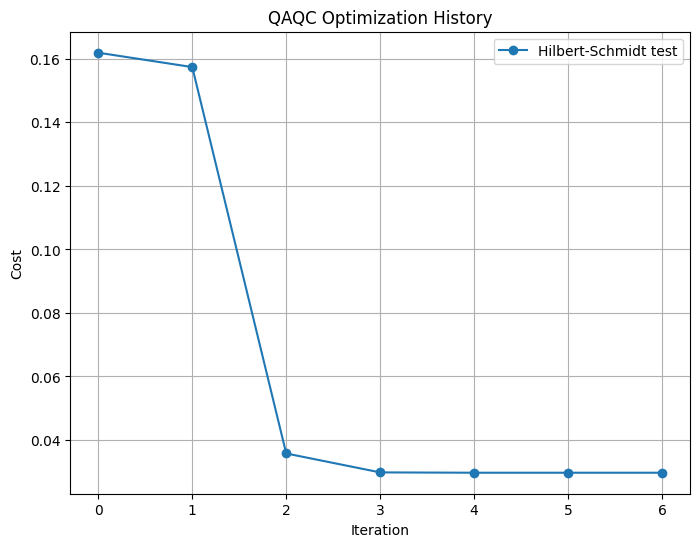

# Quick Start

Setting up QURI SDK requires Python 3.10 or later.

We recommend using a virtual environment for the installation.

```bash
$ python -m venv .venv
$ source .venv/bin/activate
```

Installation is as easy as

```bash
(.venv)$ pip install quri-sdk
```

## Your first quantum circuit in QURI Parts

Using QURI Parts

```python
from quri_parts.circuit import QuantumCircuit

qubit_count = 2

circuit = QuantumCircuit(qubit_count)  # create an empty quantum circuit with 2 qubits
circuit.add_H_gate(0)  # Add Hadamard gate on 0'th qubit
circuit.add_CNOT_gate(0,1)
```

Now try to draw the circuit to see what it looks like

```python
circuit.draw()
```

```output
   ___          
  | H |         
--|0  |-----●---
  |___|     |   
           _|_  
          |CX | 
----------|1  |-
          |___|
```

We can easily sample this circuit

```python
n_shots = 10**4
samples = circuit.sample(n_shots)
print(samples)
```

```output
Counter({3: 5043, 0: 4957})
```

## Your first resource estimate in QURI VM

Using QURI VM generate a virtual machine and see how the circuit we defined runs on a fault tolerant device

```python
from quri_vm import VM
from quri_parts.backend.devices import clifford_t_device
from quri_parts.backend.units import TimeUnit, TimeValue

physical_error_rate=1.0e-5
d=7
qec_cycle_us=1.0
delta_sk=1.0e-5
mode_block="compact"

device_property = clifford_t_device.generate_device_property(
        qubit_count=qubit_count,
        code_distance=d,
        qec_cycle=TimeValue(qec_cycle_us, TimeUnit.MICROSECOND),
        delta_sk=delta_sk,
        physical_error_rate=physical_error_rate,
        mode_block=mode_block
    )
vm = VM.from_device_prop(device_property)

samples = vm.sample(circuit, n_shots)
print(samples)
```

```output
Counter({0: 5033, 3: 4967})
```

Analyze the circuit to see how long it takes to run fault tolerantly, as well as the fidelity and other properties

```python
from pprint import pprint

analysis = vm.analyze(circuit)
pprint(analysis)
```

```output
AnalyzeResult(lowering_level=<LoweringLevel.ArchLogicalCircuit: 1>,
              qubit_count=2,
              gate_count=2,
              depth=2,
              latency=TimeValue(value=35000.0, unit=<TimeUnit.NANOSECOND>),
              fidelity=0.999999994290949)
```

## Your first quantum algorithm in QURI Algo

Try running QAQC using QURI Algo. This is an algorithm that compresses quantum circuits by variational optimization.

```python
from quri_parts.core.operator import Operator, pauli_label
from quri_parts.algo.ansatz import Z2SymmetryPreservingReal

from quri_algo.algo.compiler import QAQC
from quri_algo.core.cost_functions import HilbertSchmidtTest
from quri_algo.circuit.time_evolution.trotter_time_evo import TrotterTimeEvolutionCircuitFactory
from quri_algo.problem.operators.hamiltonian import QubitHamiltonian

REPS=4
N_TROTTER=100
EVOLUTION_TIME=0.1

ansatz=Z2SymmetryPreservingReal(qubit_count,reps=REPS)

# Hamiltonian operator
hamiltonian = Operator()
hamiltonian.add_term(pauli_label("X0 X1"), 1.0)
hamiltonian.add_term(pauli_label("Z0"), -1.0)
hamiltonian.add_term(pauli_label("Z1"), -1.0)

# Input for quantum algorithms
hamiltonian_input = QubitHamiltonian(qubit_count, hamiltonian)

# Time evolution operator
time_evo_circuit_factory = TrotterTimeEvolutionCircuitFactory(hamiltonian_input, n_trotter=N_TROTTER)

# Cost function for QAQC, we use the estimator provided by the virtual machine
hstest = HilbertSchmidtTest(vm.estimate)

# algorithm itself
qaqc = QAQC(cost_fn=hstest)

compilation_result = qaqc.run(time_evo_circuit_factory,ansatz,evolution_time=EVOLUTION_TIME)
```

Let's plot the cost history

```python
import matplotlib.pyplot as plt

# Assuming compilation_result contains some metrics to plot
# Extracting example data (replace with actual data from compilation_result)
iterations = range(len(compilation_result.cost_function_history[1:]))
costs = compilation_result.cost_function_history[1:]

# Plotting the cost history
plt.figure(figsize=(8, 6))
plt.plot(iterations, costs, marker='o', label='Hilbert-Schmidt test')
plt.xticks(iterations)
plt.title('QAQC Optimization History')
plt.xlabel('Iteration')
plt.ylabel('Cost')
plt.legend()
plt.grid(True)
plt.show()
```





## Can I also analyze the resources of a quantum algorithm?

Yes, it's easy in fact

```python
analysis = qaqc.analyze(time_evo_circuit_factory, ansatz, compilation_result, vm.analyze, n_shots, evolution_time=0.1)

print(f"Algorithm runtime: {analysis.total_latency.in_ns()*1e-9/3600} h, minimum fidelity: {min(analysis.circuit_fidelities.values())}")
```

```output
Algorithm runtime: 690.4625 h, minimum fidelity: 0.9993594098017704
```


## Interesting, where can I learn more?

Glad you asked!

Connect with us on [Slack](https://qurisdk.slack.com) and check out our [tutorials](index.md) and [how-to guides](../howto/index.md).
