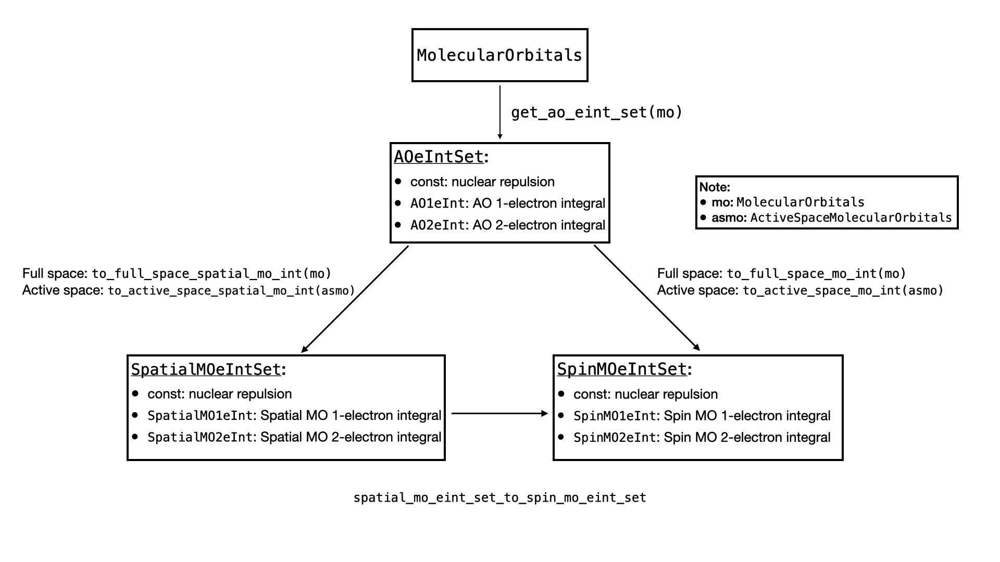

# Advanced Guides on Electron Integral


Computing the electron integrals is a crucial part of quantum chemistry, especially for the generation of molecular Hamiltonians. In previous tutorials, we explained how to obtain electron integrals (eInts) as well as the molecular Hamiltonian. In this tutorial, we give more detailed introductions on objects that QURI Parts provides for computing eInts, so that you may customize your algorithms for efficient eInt computations.


The standard steps of computing the electron integrals (eInts) involve:

1. Obtain AO eInts from the molecule.
2. Run self-consistent computation.
3. Obtain spatial MO eInts from AO eInts and RHF.
4. Convert spatial MO eInts to spin MO eInts.

As there are multiple types of electron integrals involved in the computation, and it is usually the case that we only need the spin MO eInt, QURI Parts provide 2 ways of obtaining the spin MO eInt.

- Save all the intermediate eInts on memory.
- Release the eInt array to the memory on demand.

We will present how to do the two versions of computations in this tutorial.

## Overview

Here we give a brief introduction of how to perform the two versions of computation.

### **Quick summary: Compute with storing the electron integral arrays on memory**

#### 1. Define the molecule


```python
from pyscf import gto, scf
from quri_parts.pyscf.mol import PySCFMolecularOrbitals, get_ao_eint_set

mole = gto.M(atom="O 0 0 0; H 0.2774 0.8929 0.2544; H 0.6068, -0.2383, -0.7169")
mf = scf.RHF(mole).run(verbose=0)
mo = PySCFMolecularOrbitals(mole, mf.mo_coeff)
```

#### 2. Compute the AO eInts


```python
ao_eint_set = get_ao_eint_set(mo, store_array_on_memory=True)
```

#### 3. Compute the spin MO eInts 


```python
spin_mo_eint_set = ao_eint_set.to_full_space_mo_int(mo)

h2o_const = spin_mo_eint_set.const
h2o_1e_int = spin_mo_eint_set.mo_1e_int.array
h2o_2e_int = spin_mo_eint_set.mo_2e_int.array
```

#### 4. Compute the active space spin MO eInts


```python
from quri_parts.chem.mol import ActiveSpaceMolecularOrbitals, cas

# Define the active space
active_space = cas(n_active_ele=6, n_active_orb=4)
asmo = ActiveSpaceMolecularOrbitals(mo, active_space)

# Compute the active space MO integrals
cas_spin_mo_eint_set = ao_eint_set.to_active_space_mo_int(asmo)

h2o_cas_const = cas_spin_mo_eint_set.const
h2o_cas_1e_int = cas_spin_mo_eint_set.mo_1e_int.array
h2o_cas_2e_int = cas_spin_mo_eint_set.mo_2e_int.array
```

### **Quick summary: Compute without storing the electron integral arrays on memory**

#### 1. Define the molecule


```python
from pyscf import gto, scf
from quri_parts.pyscf.mol import PySCFMolecularOrbitals, get_ao_eint_set

mole = gto.M(atom="O 0 0 0; H 0.2774 0.8929 0.2544; H 0.6068, -0.2383, -0.7169")
mf = scf.RHF(mole).run(verbose=0)
mo = PySCFMolecularOrbitals(mole, mf.mo_coeff)
```

#### 2. Compute the AO eInts


```python
ao_eint_set = get_ao_eint_set(mo)
```

#### 3. Compute the spin MO eInts 


```python
spin_mo_eint_set = ao_eint_set.to_full_space_mo_int(mo)

# nuclear repulsion
h2o_const = spin_mo_eint_set.const
# 1-electron eInt array
h2o_1e_int = spin_mo_eint_set.mo_1e_int.array
# 2-electron eInt array
h2o_2e_int = spin_mo_eint_set.mo_2e_int.array
```

#### 4. Compute the active space spin MO eInts


```python
# Define the active space
active_space = cas(n_active_ele=6, n_active_orb=4)
asmo = ActiveSpaceMolecularOrbitals(mo, active_space)

# Compute the active space MO integrals
cas_spin_mo_eint_set = ao_eint_set.to_active_space_mo_int(asmo)

# active space nuclear repulsion
h2o_cas_const = cas_spin_mo_eint_set.const
# active space 1-electron eInt array
h2o_cas_1e_int = cas_spin_mo_eint_set.mo_1e_int.array
# active space21-electron eInt array
h2o_cas_2e_int = cas_spin_mo_eint_set.mo_2e_int.array
```

### Quick comment

The two computations above looks almost the same. The only difference is in `get_ao_eint_set`, where one sets the `store_array_on_memory` argument to True. However, they behave very differently under the hood. 

In the first version where the `store_array_on_memory = True`, the AO electron integrals are released to the memory right after `get_ao_eint_set`, `ao_eint_set.to_full_space_mo_int` and `ao_eint_set.to_active_space_mo_int` are executed. This takes up more memory but can provide potential speed advantage. We will discuss how to compute electron integrals in the shortest amount of time in later sections.

For the second version where we use the default `store_array_on_memory = False`, the explicit eInt array are released to memory only when the `.array` property is called. This saves up a lot of memory during actual computations and has more advantages when we are considering larger molecules. In the Hamiltonian generation tutorial, the `get_spin_mo_integrals_from_mole` runs this version of computation.

## The electron integral interface

As there are multiple kinds of electron integrals, this section is devoted to explain how they are represented in QURI Parts.

There are 3 types of electron integrals, and each of them can be divided into constant part, 1-electron integral and 2-electron integrals.

- Atomic orbital (AO) electron integrals (`AOeIntSet`):
    - constant: nuclear repulsion
    - `AO1eInt`: 1-electron AO integral.
    - `AO2eInt`: 2-electron AO integral.
- Spatial molecular orbital (MO) electron integrals (`SpatialMOeIntSet`):
    - constant: nuclear repulsion
    - `SpatialMO1eInt`: 1-electron spatial MO integral
    - `SpatialMO2eInt`: 2-electron spatial MO integral
- Spin molecular orbital (MO) electron integrals (`SpinMOeIntSet`):
    - constant: nuclear repulsion
    - `SpinMO1eInt`: 1-electron spatial MO integral
    - `SpinMO2eInt`: 2-electron spatial MO integral

All the `...1eInt` and `...2eInt` objects provide `.array` property that allows us to retrieve the explicit electron integral represented by a Numpy array.

In QURI Parts, the relations between the electron integral sets are represented by the following diagram.



## Compute the Electron Integrals

Here, we introduce the first way of computing the electron integrals, where we release all the electron integrals of each intermediate step onto the memory. We first list out all the objects that represents an electron integral:

- AO electron integral: `AOeIntArraySet`, which contains:
    - constant: The nuclear repulsion energy.
    - `AO1eIntArray`: The AO 1-electron integral array on memory
    - `AO2eIntArray`: The AO 2-electron integral array on memory
- Spatial electron integral: `SpatialMOeIntSet`, which contains:
    - constant: The nuclear repulsion energy.
    - `SpatialMO1eIntArray`: The spatial MO 1-electron integral array on memory
    - `SpatialMO2eIntArray`: The spatial MO 2-electron integral array on memory
- Spin electron integral: `SpinMOeIntSet`, which contains:
    - constant: The nuclear repulsion energy.
    - `SpinMO1eIntArray`: The spin MO 1-electron integral array on memory
    - `SpinMO2eIntArray`: The spin MO 2-electron integral array on memory

### Computing the AO electron integrals

One can construct the `AOeIntArraySet` using the `get_ao_eint_set` function. When the `store_array_on_memory` argument is set to True, it returns an `AOeIntArraySet` object that stores the AO electron integrals on memory.


```python
from quri_parts.pyscf.mol import get_ao_eint_set

ao_eint_set= get_ao_eint_set(mo, store_array_on_memory=True)

# the nuclear repulsion energy
nuc_energy= ao_eint_set.constant

# the AO one-electron integrals: an AO1eIntArray object
ao_1e_int= ao_eint_set.ao_1e_int

# the AO two-electron integrals: an AO2eIntArray object
ao_2e_int= ao_eint_set.ao_2e_int 
```

One can access the explicit array of the electron atomic orbital integrals with the array attribute:


```python
# ao_1e_int.array
# ao_2e_int.array
```

### Computing the spatial and spin MO electron integrals

With the AO electron integrals and the `MolecularOrbitals` at hand, we may compute the:

- spatial MO electron integrals with the `to_full_space_spatial_mo_int` method
- spin MO electron integrals with the `to_full_space_mo_int` methods

in `ao_eint_set`. Note that the explicit array of the integrals are computed and released to the memory once these methods are called.


```python
# Computes the full space spatial mo electron integrals
spatial_mo_e_int_set = ao_eint_set.to_full_space_spatial_mo_int(mo)

# Computes the full space spin mo electron integrals
spin_mo_e_int_set = ao_eint_set.to_full_space_mo_int(mo)
```

To access the explicit array of the integrals, you may run:


```python
# For the spatial MO electron integrals
nuclear_repulsion_energy = spatial_mo_e_int_set.const
spatial_1e_int = spatial_mo_e_int_set.mo_1e_int.array
spatial_2e_int = spatial_mo_e_int_set.mo_2e_int.array

# For the spin MO electron integrals
nuclear_repulsion_energy = spin_mo_e_int_set.const
spin_1e_int = spin_mo_e_int_set.mo_1e_int.array
spin_2e_int = spin_mo_e_int_set.mo_2e_int.array
```

### Computing the active space electron integrals

The active space spin and spatial MO eInts can also be computed in a similar way. Instead of using the full space `MolecularOrbitals`, we compute the:

- active space spatial MO eInt with the `to_active_space_spatial_mo_int` method
- active space spin MO eInt with the `to_active_space_mo_int` method

by passing in the `ActiveSpaceMolecularOrbitals`. Note that the explicit eInt arrays are released onto the memory once these methods are called.


```python
# Computing the active space spatial mo electron integrals
active_space_spatial_integrals = ao_eint_set.to_active_space_spatial_mo_int(active_space_mo=asmo)

# Computing the active space spin mo electron integrals
active_space_spin_integrals = ao_eint_set.to_active_space_mo_int(active_space_mo=asmo)
```

To obtain the explicit active space MO eInts


```python
# For the spatial MO electron integrals
active_space_nuclear_repulsion_energy = active_space_spatial_integrals.const
active_space_spatial_1e_int = active_space_spatial_integrals.mo_1e_int.array
active_space_spatial_2e_int = active_space_spatial_integrals.mo_2e_int.array

# For the spin MO electron integrals
active_space_nuclear_repulsion_energy = active_space_spin_integrals.const
active_space_spin_1e_int = active_space_spin_integrals.mo_1e_int.array
active_space_spin_2e_int = active_space_spin_integrals.mo_2e_int.array
```

### Computing active space eInt with optimal efficiency

To achieve optimal efficiency when computing active space eInts, we recommend using the

- `get_active_space_spatial_integrals_from_mo_eint`
- `get_active_space_spin_integrals_from_mo_eint`

functions as the `to_active_space_spatial_mo_int` and `to_active_space_mo_int` methods computes the full space MO eInt first before projecting them onto the selected active space. This does not matter if one wants to compute eInts for only one active space configuration. However, the MO eInts are calculated repeatedly if *multiple active space eInts* are required and can cause performance penalty. Thus, it is more efficient if we compute the MO eInt *once and store it on memory* and then project the eInts to the desired active spaces with the aforementioned functions:


```python
from quri_parts.chem.mol import (
    get_active_space_spatial_integrals_from_mo_eint,
    get_active_space_spin_integrals_from_mo_eint
)

# Computing the active space spatial mo electron integrals
active_space_spatial_integrals = get_active_space_spatial_integrals_from_mo_eint(
    active_space_mo=asmo, electron_mo_ints=spatial_mo_e_int_set
)

# Computing the active space spin mo electron integrals
active_space_spin_integrals = get_active_space_spin_integrals_from_mo_eint(
    active_space_mo=asmo, electron_mo_ints=spatial_mo_e_int_set
)
```

## Compute the electron integrals in a memory efficient manner

When the molecule gets larger, it is unrealistic to store the full space mo electron integrals on memory, most especially when we just want to get the eInts of a small active space from a big molecule. In QURI Parts, we provide a memory efficient way of computing the active space integrals while bypassing the full space electron integrals. The idea is to store only the PySCF Mole object and the mo coefficients on memory. The explicit eInts are only released onto the memory on demand.

We first introduce the objects used to perform memory efficient eInt evaluation

- AO electron integral: `PySCFAOeIntSet`, which contains:
    - constant: The nuclear repulsion energy.
    - `PySCFAO1eInt`: The AO 1-electron integral.
    - `PySCFAO2eInt`: The AO 2-electron integral.
- Full space spatial electron integral: `SpatialMOeIntSet`, which contains:
    - constant: The nuclear repulsion energy.
    - `PySCFSpatialMO1eInt`: The spatial MO 1-electron integral.
    - `PySCFSpatialMO2eInt`: The spatial MO 2-electron integral.
- Full space spin electron integral: `SpinMOeIntSet`, which contains:
    - constant: The nuclear repulsion energy.
    - `PySCFSpinMO1eInt`: The spin MO 1-electron integral.
    - `PySCFSpinMO2eInt`: The spin MO 2-electron integral.

The above objects only holds the Molecule objects and the mo coefficients. The actual eInt array are only computed when the `.array` property is accessed. For the active space MO eInts, they are stored by:

- Active space spatial electron integral: `SpatialMOeIntSet`, which contains:
    - constant: The nuclear repulsion energy.
    - `SpatialMO1eIntArray`: The spatial MO 1-electron integral.
    - `SpatialMO2eIntArray`: The spatial MO 2-electron integral.
- Active space spin electron integral: `SpinMOeIntSet`, which contains:
    - constant: The nuclear repulsion energy.
    - `SpinMO1eIntArray`: The spin MO 1-electron integral.
    - `SpinMO2eIntArray`: The spin MO 2-electron integral.

where the explicit array are released to the memory once the `PySCFAOeIntSet.to_active_space_mo_int` or `PySCFAOeIntSet.to_active_space_spatial_mo_int` is called.

### Computing the AO spatial electron integrals

We may obtain the `PySCFAOeIntSet` using the `get_ao_eint_set` function with the `store_array_on_memory` option to False


```python
# This constructs a PySCFAOeIntSet object, which only holds pyscf mol object on memory

pyscf_ao_eint_set = get_ao_eint_set(
    mo,
    store_array_on_memory=False  # default to False
)
```

### Computing the spatial and spin MO electron integrals

As in the `AOeIntArraySet`, the full space spatial and spin MO eInts can be calculated by the `to_full_space_spatial_mo_int` and `to_full_space_mo_int` respectively.


```python
# Returns a SpatialMOeIntSet object, which only holds the molecule and the mo coefficients on memory
pyscf_spatial_mo_eint_set = pyscf_ao_eint_set.to_full_space_spatial_mo_int(mo)

# Returns a SpinMOeIntSet object, which only holds the molecule and the mo coefficients on memory
pyscf_spin_mo_eint_set = pyscf_ao_eint_set.to_full_space_mo_int(mo)
```

The explicit electron integrals are only computed on demand when the `array` property is accessed


```python
# For the spatial MO electron integrals
pyscf_nuclear_repulsion_energy = pyscf_spatial_mo_eint_set.const
pyscf_spatial_1e_int = pyscf_spatial_mo_eint_set.mo_1e_int.array  # computation happens here
pyscf_spatial_2e_int = pyscf_spatial_mo_eint_set.mo_2e_int.array  # computation happens here

# For the spin MO electron integrals
pyscf_nuclear_repulsion_energy = pyscf_spin_mo_eint_set.const
pyscf_spin_1e_int = pyscf_spin_mo_eint_set.mo_1e_int.array  # computation happens here
pyscf_spin_2e_int = pyscf_spin_mo_eint_set.mo_2e_int.array  # computation happens here
```

### Getting the active space spin electron integrals

We may also compute the:

- active space spatial MO eInt with the `PySCFAOeIntSet.to_active_space_spatial_mo_int` method
- active space spin MO eInt with the `PySCFAOeIntSet.to_active_space_mo_int` method

just like how we computed them with the `AOeIntArraySet`. Note that the computation is performed with `pyscf`’s `CASCI` once these methods are called.


```python
# Computing the active space spatial mo electron integrals
pyscf_active_space_spatial_integrals = pyscf_ao_eint_set.to_active_space_spatial_mo_int(asmo)

# Computing the active space spin mo electron integrals
pyscf_active_space_spin_integrals = pyscf_ao_eint_set.to_active_space_mo_int(asmo)
```
