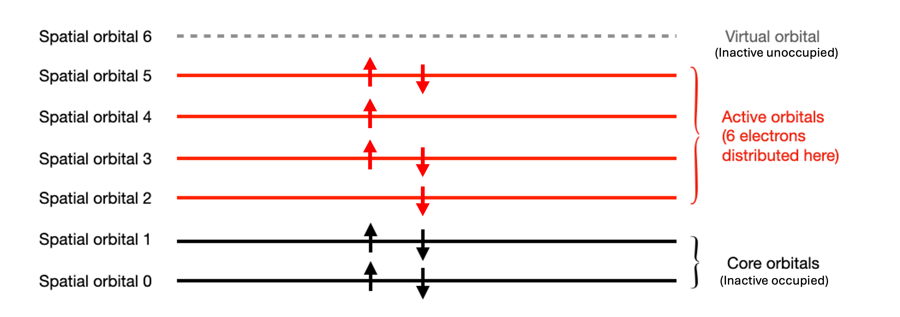

# Representing Quantum Chemical Systems

In this section, we introduce the `MolecularOrbitals` object, which is what represents a quantum chemical system such as a molecule in QURI Parts.

The `MolecularOrbitals` is a protocol class that is defined to hold:

- number of electrons in the system.
- number of spatial orbitals in the system.
- $s_z$ of the system.
- molecular orbital coefficient (mo coefficient).

In this tutorial, we specifically focus on `PySCFMolecularOrbitals`, which is what represents a molecule in QURI Parts with [PySCF](https://pyscf.org/) input. We will also introduce the `ActiveSpaceMolecularOrbitals` object, which holds the active space information of the molecule.

## Defining the Molecules and Molecular Orbitals

Now, let's first build a water molecule with PySCF and create a `PySCFMolecularOrbitals`.


```python
from pyscf import gto, scf

mole = gto.M(atom="O 0 0 0; H 0.2774 0.8929 0.2544; H 0.6068, -0.2383, -0.7169")
mf = scf.RHF(mole).run(verbose=0)
```

The `PySCFMolecularOrbitals` is created with a `pyscf.gto.Mole` object and an array that represents the mo coefficient.


```python
from quri_parts.pyscf.mol import PySCFMolecularOrbitals

h2o_mo = PySCFMolecularOrbitals(mole, mf.mo_coeff)
print(f'Number of electrons: {h2o_mo.n_electron}')
print(f'Number of spatial orbitals: {h2o_mo.n_spatial_orb}')
print(f'Spin of the molecule: {h2o_mo.spin}')
print(f'MO coefficients:\n {h2o_mo.mo_coeff.round(3)}')
```
```output
Number of electrons: 10
Number of spatial orbitals: 7
Spin of the molecule: 0
MO coefficients:
 [[ 0.994 -0.233 -0.     0.103  0.    -0.13   0.   ]
 [ 0.026  0.838  0.    -0.535 -0.     0.863 -0.   ]
 [ 0.003  0.093 -0.131  0.572  0.636  0.552 -0.212]
 [ 0.002  0.069  0.45   0.424 -0.388  0.408  0.728]
 [-0.002 -0.049  0.386 -0.299  0.667 -0.289  0.625]
 [-0.006  0.158  0.446  0.283  0.    -0.788 -0.828]
 [-0.006  0.158 -0.446  0.283  0.    -0.788  0.828]]
```
## Specifying active space configuration

Sometimes, it is enough to consider the transition between a subset of the spatial orbitals. This is equivalent to assigning an [active space configuration](https://en.wikipedia.org/wiki/Complete_active_space) to the system. In this case, the spatial orbitals are partitioned into 3 classes.

- core orbitals: Spatial orbitals with 2 electrons.
- active orbitals: Orbitals where the electrons are allowed to freely transit from and to.
- virtual orbitals: Spatial orbitals with no electrons.

The electrons are also partitioned into 2 sets:

- core electrons: electrons that live in the core orbitals.
- active electrons: electrons that live in the active orbitals.

In QURI Parts, an active space configuration is specified by the `ActiveSpace` object.


```python
from quri_parts.chem.mol import ActiveSpace, cas

active_space = ActiveSpace(n_active_ele = 6, n_active_orb = 4)
# or equivalently:
active_space = cas(n_active_ele = 6, n_active_orb = 4)
print(active_space)
```
```output
ActiveSpace(n_active_ele=6, n_active_orb=4, active_orbs_indices=None)
```
We can then assign the active space to a molecule by creating an `ActiveSpaceMolecularOrbitals`. It will provide detailed information about the molecule after the active space is assigned to it:




```python
from quri_parts.chem.mol import ActiveSpaceMolecularOrbitals

asmo = ActiveSpaceMolecularOrbitals(h2o_mo, active_space)
print("The molecule configuration with active space assigned to it:\n")
print(asmo)
```
```output
The molecule configuration with active space assigned to it:

n_electron: 10
n_active_ele: 6
n_core_ele: 4
n_ele_alpha: 3
n_ele_beta: 3
n_spatial_orb: 7
n_active_orb: 4
n_core_orb: 2
n_vir_orb: 1
```
To obtain the list of core and active orbitals, we can use the `get_core_and_active_orb` method.


```python
core_orbital_list, active_orbital_list = asmo.get_core_and_active_orb()
print("core spatial orbitals:", core_orbital_list)
print("active spatial orbitals:", active_orbital_list)
```
```output
core spatial orbitals: [0, 1]
active spatial orbitals: [2, 3, 4, 5]
```
We can also obtain the spatial orbital's type with the `orb_type` method.


```python
print("Type of sptial orbital 0:", asmo.orb_type(0))
print("Type of sptial orbital 2:", asmo.orb_type(2))
print("Type of sptial orbital 6:", asmo.orb_type(6))
```
```output
Type of sptial orbital 0: OrbitalType.CORE
Type of sptial orbital 2: OrbitalType.ACTIVE
Type of sptial orbital 6: OrbitalType.VIRTUAL
```